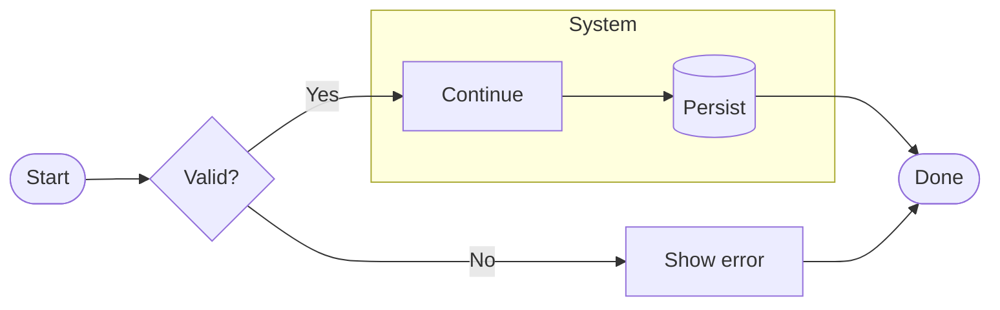
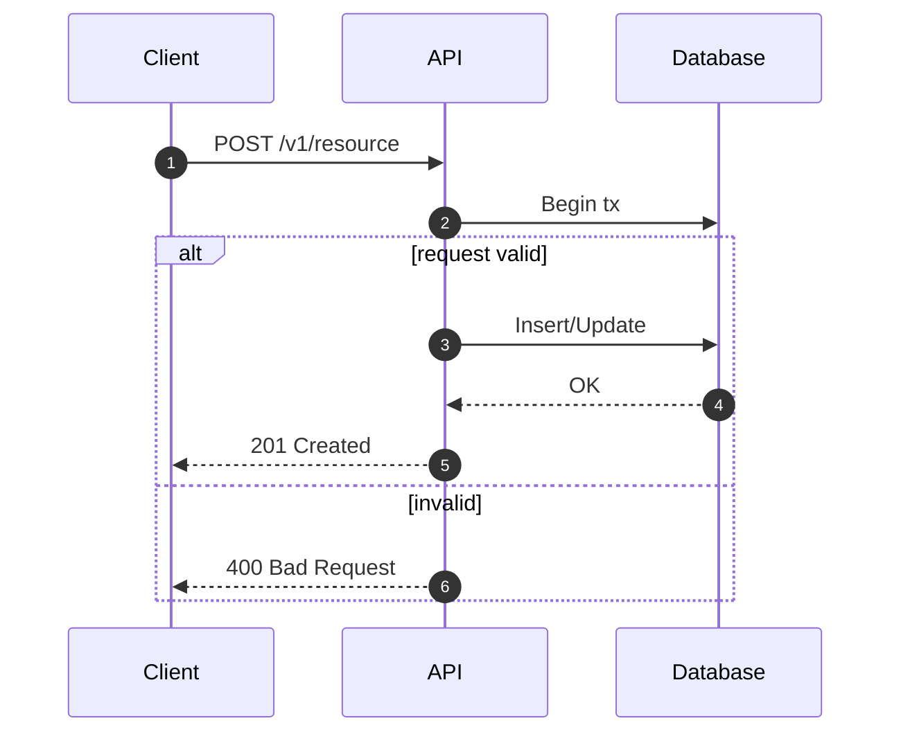
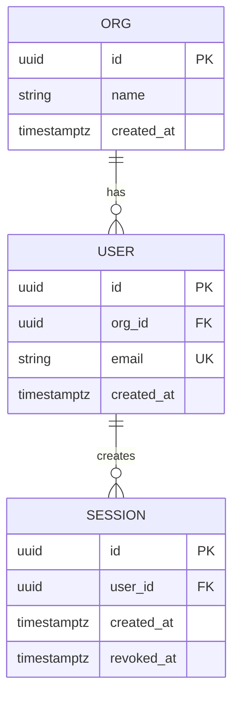
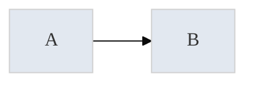

# Mermaid Expert - Implementation Playbook

Use this playbook when the task benefits from concrete, reusable diagram patterns and consistently rendered Mermaid output.

## Default Output Contract

When asked to produce a diagram:

- Ask for the *purpose* and *audience* (on-call, dev, exec, onboarding).
- Choose the minimal diagram type that answers the question.
- Produce:
  - A basic Mermaid diagram (render-safe)
  - An optional styled variant (theme/config), if it improves clarity
  - 1-3 notes on how to read it + what is intentionally omitted

## Diagram Type Selection

- `flowchart` - process, decision tree, pipelines
- `sequenceDiagram` - request flows, auth, messaging timing
- `erDiagram` - relational schema / data model
- `classDiagram` - domain/object model, interfaces, dependencies
- `stateDiagram-v2` - lifecycle states, state machines
- `gantt` / `timeline` - plans and milestones (keep high-level)
- `gitGraph` - branching strategy
- `journey` - user journey / experience steps
- `quadrantChart` / `pie` - simple communication visuals

## Render Safety Checklist

- Wrap diagrams in a fenced block:
  - Use exactly: ```mermaid
- Prefer simple node IDs and explicit labels.
- Avoid special characters in node IDs (use labels for readable text).
- Use `%%` comments for clarification.
- When in doubt, validate in Mermaid Live Editor.

## Reusable Patterns

### Flowchart (Decision + Subgraph)



### Sequence Diagram (Alt/Opt)



### ERD (Keys + Cardinality)



## Styling (Optional)

When styling is requested (or improves comprehension), prefer Mermaid config frontmatter:



## Reference Files

For deeper patterns, see `mermaid-expert/references/`.
