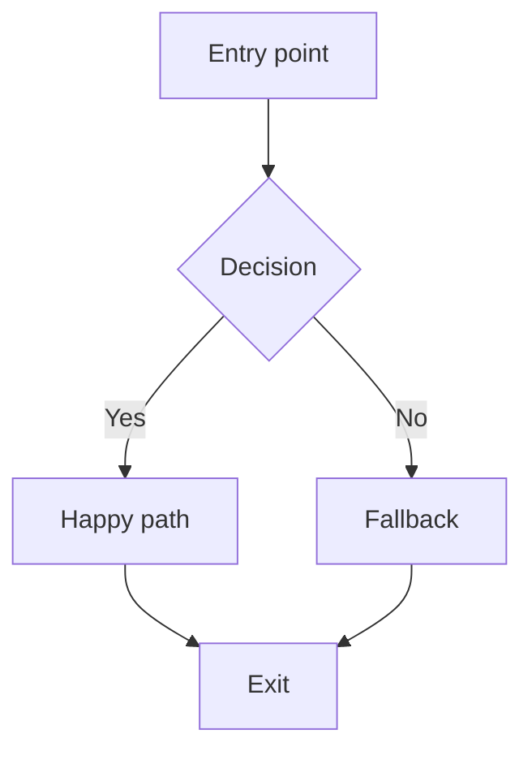
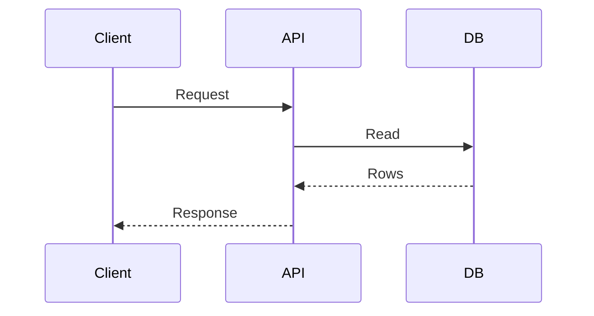
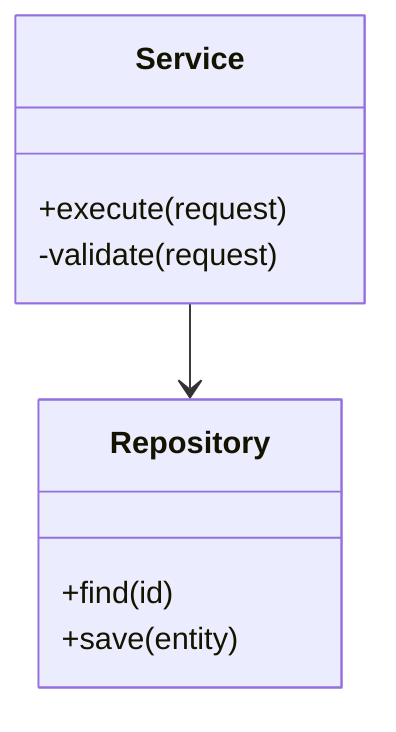

# Diagram Patterns

Use diagrams when a flow has multiple branches, async steps, or layered components.

## Flowchart (control flow)

## Sequence (request lifecycle)

## Class diagram (data model or APIs)

## Selection tips

- Prefer flowcharts for branching control flow.
- Prefer sequence diagrams for async or multi-service interactions.
- Prefer class diagrams for object relationships or stable APIs.
