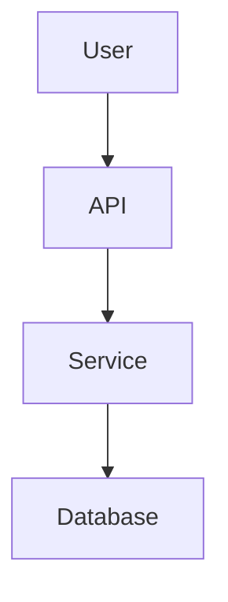

# Architecture Documentation Playbook

## Outcomes

- Clear system boundary and component responsibilities.
- Data flow explanation for primary flows.
- Integration points and operational dependencies.

## Outline

- Overview (system purpose, non-goals).
- Components and responsibilities.
- Data flows (request path and async flows).
- Storage and data model summary.
- External integrations and contracts.
- Operational considerations (reliability, scaling, failure modes).

## Data-flow trace method

The data-flow section is produced by tracing a path through the code, not by summarizing what the system does. Pick one representative request — the most common write path, not the simplest read — and answer four questions in order, recording the file and symbol that answers each:

1. Where does it enter? Router, handler, controller, message consumer, or scheduled entry.
2. What can reject it before business logic sees it? Middleware, schema validation, guards, authentication and authorization.
3. Where does the business logic live? A service, use case, or model method — or the handler itself, when the repo has no separate layer. Say which, because "there is no service layer" is a finding.
4. How does it reach durable state? Data-access layer, repository, raw query, published event, or an outbound call to another system.

Write the answers as a numbered path with a file reference per hop, so a reader can open every hop in order. If a hop cannot be found, name it as a gap in the path rather than closing the gap by omission — an unexplained jump from handler to database is the reader's first question, and a silently skipped hop reads as a claim that none exists.

Repeat the trace for one asynchronous or scheduled flow when the system has one. Only the first question changes (queue, cron, webhook, stream); the other three carry over.

Where an existing diagram and the traced code disagree, the code is the evidence and the stale diagram is a finding to record, not a shortcut to reuse.

## Diagram guidance

- Use a single high-level diagram for system boundaries.
- Add a flow diagram only for critical paths.
- Keep naming consistent with repo module names.

## Mermaid example

```mermaid
graph TD
  User --> API
  API --> Service
  Service --> Database
```
