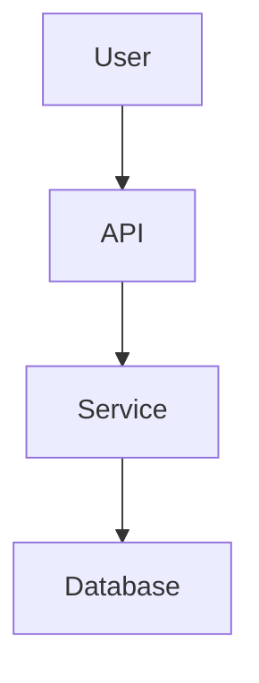

# Architecture Documentation Playbook

## Outcomes

- Clear system boundary and component responsibilities.
- Data flow explanation for primary flows.
- Integration points and operational dependencies.

## Outline

- Overview (system purpose, non-goals).
- Components and responsibilities.
- Data flows (request path and async flows).
- Storage and data model summary.
- External integrations and contracts.
- Operational considerations (reliability, scaling, failure modes).

## Diagram guidance

- Use a single high-level diagram for system boundaries.
- Add a flow diagram only for critical paths.
- Keep naming consistent with repo module names.

## Mermaid example

