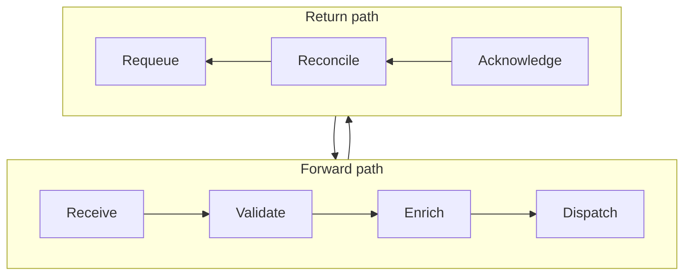
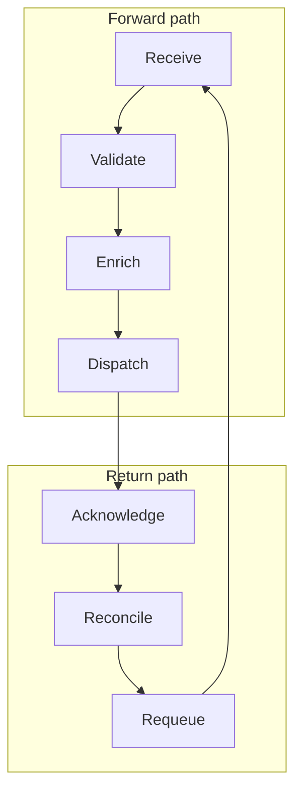
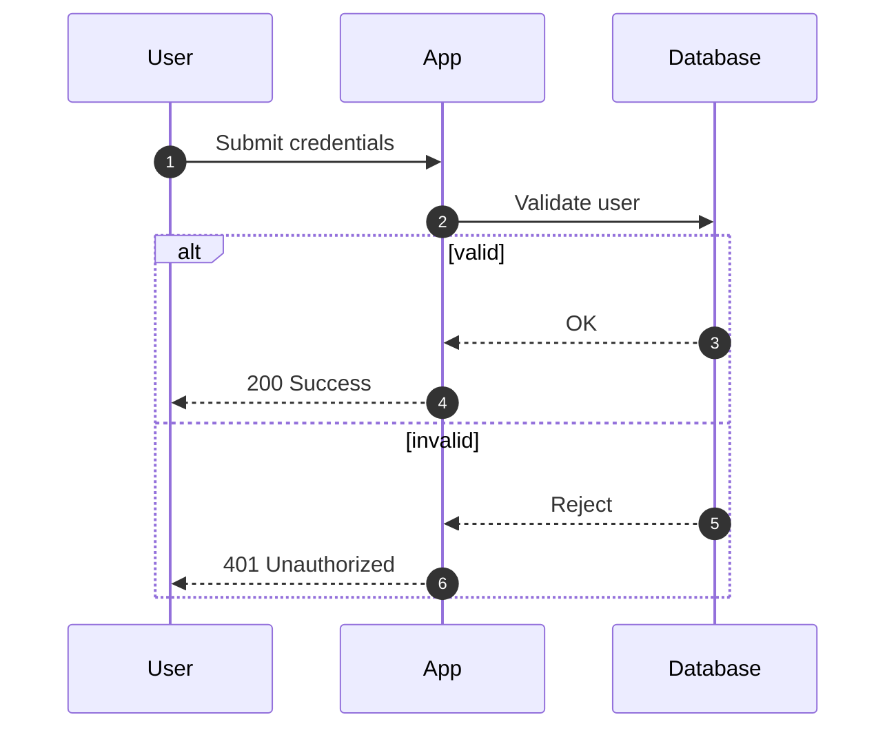
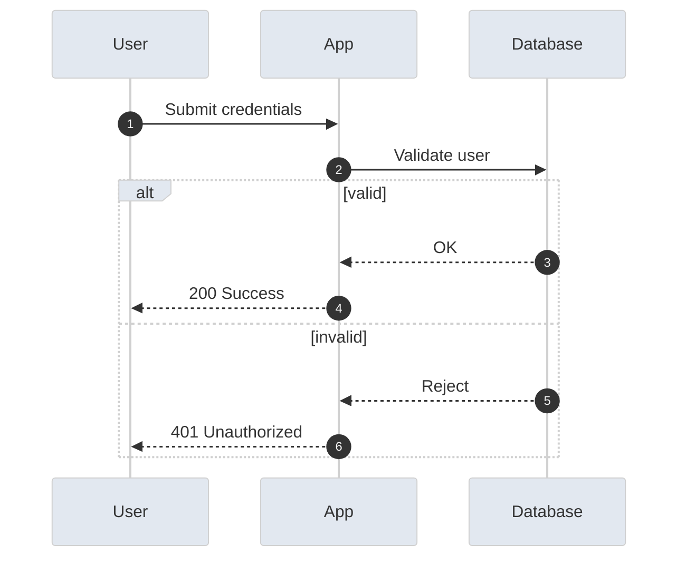

# Mermaid Expert

## Use this skill when

- Mermaid diagram code is needed for system, process, or data visuals.
- Guidance is needed to select the right Mermaid diagram type and syntax.
- Both basic and styled diagram variants with explanations are required.
- A decision is needed on how a diagram is delivered: embedded source versus exported image, and how a broken diagram should surface.

## Do not use this skill when

- The request is not about Mermaid diagrams or diagram structure.
- A rendered image or non-Mermaid diagram tooling is required.
- Live network rendering or external design assets are required.

## Required inputs

- Diagram purpose and audience (on-call, dev, exec, onboarding).
- Entities/steps/relationships to include.
- Target renderer constraints (e.g., Mermaid version, Markdown support).
- Style preferences (theme, color constraints) or "basic only" request.

## Instructions

If detailed examples are required, consult `resources/implementation-playbook.md`.

## Workflow
1. Confirm requirements and constraints.
   - Output: brief summary of purpose, audience, renderer, and missing info.
2. Select the diagram type and scope.
   - Output: chosen Mermaid diagram type with a one-line rationale.
3. Draft the basic diagram.
   - Output: Mermaid code block with readable IDs and labels.
   - Keep node labels short and carry the detail on edge labels. A box holding a full sentence is a box the reader stops reading.
4. Add a styled variant unless the user says "basic only" or styling is unsupported.
   - Output: styled Mermaid code block or a clear reason for skipping styling.
5. Add brief interpretation notes and validation tips.
   - Output: 1–3 notes on how to read the diagram and how to validate it locally.

## Decision points
- If required inputs are missing, ask targeted questions before drafting.
- If the renderer lacks support for a diagram type (e.g., C4), fall back to `flowchart`.
- If the diagram has grown past what a reader can scan without tracing edges by hand, see `references/advanced-features.md` (Large Diagrams) for when and how to split it.
- If the layout needs to fold a long single-direction flow into two rows, use the racetrack construction below rather than fighting the default layout.

## Racetrack layout for loops

A long loop drawn as one row of nodes runs off the page. To fold it into a compact two-row layout, declare a top-level `flowchart TB`, put the forward half of the loop in one subgraph declared `direction LR`, put the return half in a second subgraph declared `direction RL`, and connect **the subgraphs to each other**.

The failure this avoids is silent. An edge drawn from a node inside one subgraph to a node inside another disables the `direction` declaration on the subgraphs involved. Mermaid raises no error and emits no warning; it falls back to the default layout, so the obvious attempt — wire the loop node to node and hope `direction` holds — produces one long line with nothing explaining why. The only difference between the diagram above and the one below is the last two edges.

Because the override produces no diagnostic, confirm the rendered layout rather than trusting the source to be self-evidently correct: if the two rows come out as one line, an edge is crossing a subgraph boundary at node level.

## Delivery

- **Ship the source, not a raster.** Embed the Mermaid source in the document rather than a PNG or JPEG export. Source renders as vector — crisp at any zoom, with text that stays selectable and searchable — and it remains editable indefinitely. A raster is a dead end: the next person to change the diagram has to rebuild it from scratch.
- **Do not hand over unverified source as though it were a diagram.** State whether the source was parsed or rendered and by what. If no renderer was available, say so plainly rather than implying the diagram is known-good.
- **Make a parse failure loud and local.** Where diagrams are embedded in a generated document, a fence that fails to parse should render in place as a visible diagnostic block carrying the parse error and an excerpt of the offending source. The surrounding document still builds, and the failure is impossible to read past. Dropping the diagram silently, or degrading it to blank space, hides the defect until a reader notices something missing.
- **Give an automated pipeline a strict mode.** The same degradation that warns during authoring should be convertible to a non-zero exit status, so a docs pipeline can fail the build on a broken diagram instead of publishing a placeholder.

## Common pitfalls
- Overcrowded diagrams that hide the main story.
- Complex node IDs or labels that break rendering.
- Unsupported syntax for the target renderer.
- Missing error paths or alternative flows in sequence diagrams.
- Styling that reduces contrast or readability.

## Output contract
Provide the following in every response:

- Diagram type selection and assumptions.
- A basic Mermaid diagram code block.
- A styled Mermaid diagram code block (or reason for omission).
- 1–3 interpretation notes and validation guidance.
- Open questions if inputs are missing.

## Examples

**Input:** "Create a Mermaid sequence diagram for a login flow with success and failure paths."

**Output:**

- **Summary:** Dev audience, Mermaid v10, Markdown rendering.
- **Diagram Type:** `sequenceDiagram` for request/response flow.
- **Basic Diagram:**

- **Styled Diagram:**

- **Notes:** Include error paths; validate in your local Mermaid renderer.

## References

- `references/README.md`
- `resources/implementation-playbook.md`

Include `%%` comments to explain complex syntax when it aids readability.
